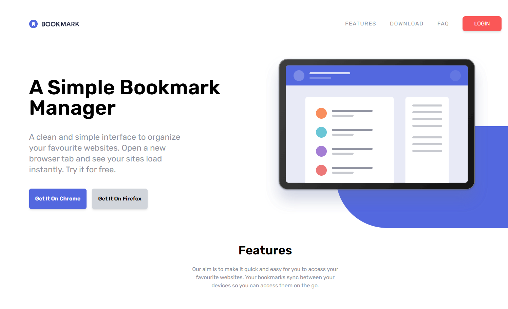
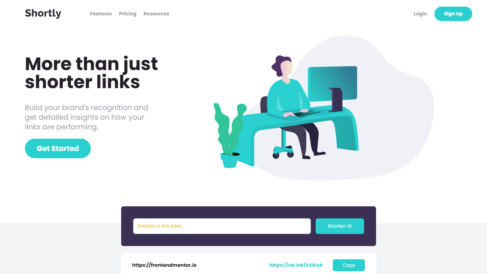
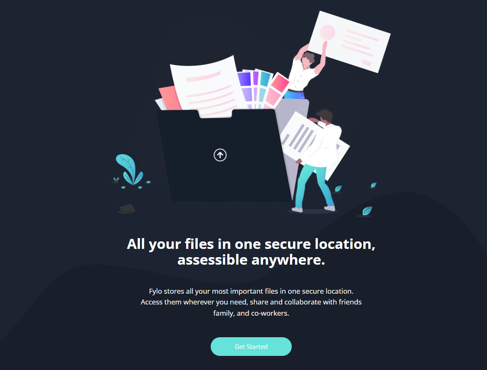
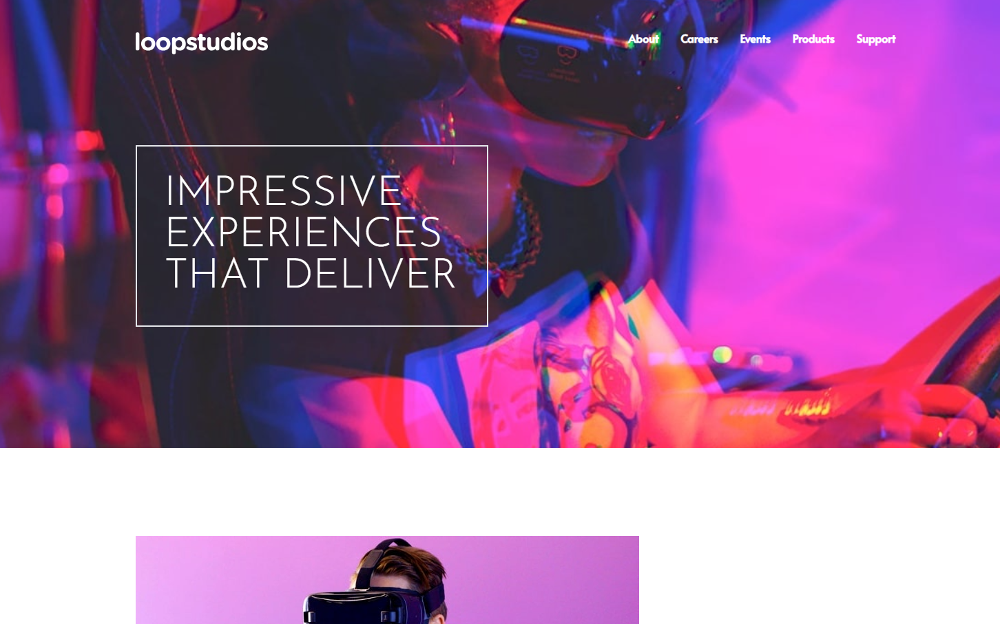
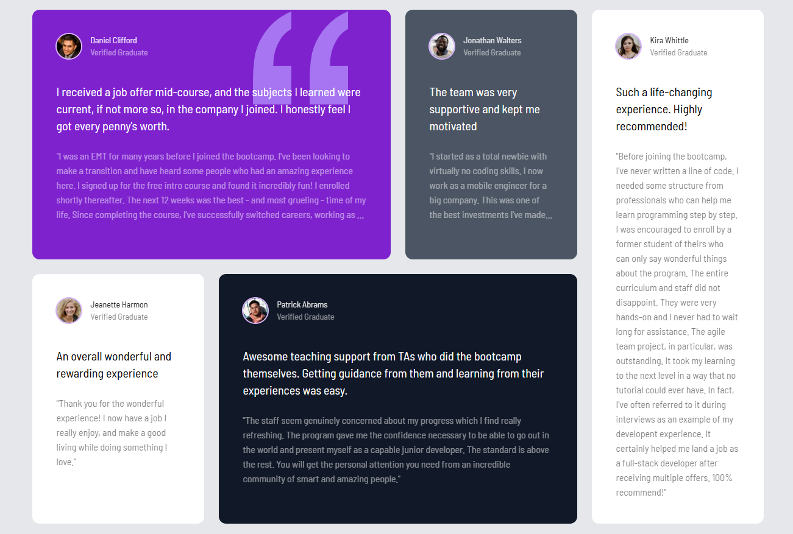
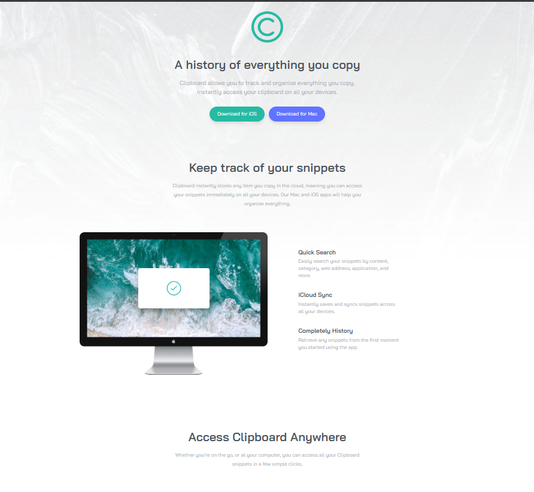

# Frontend Mini Projects

<br>

A collection of 6 responsive landing pages built with Tailwind CSS.

<br>

## Projects

| | | |
|---|---|---|
| [](./bookmark/)<br>**Bookmark**<br>*Tabs, accordion, responsive nav* | [](./shortly/)<br>**Shortly**<br>*Form input, statistics cards* | [](./fylo/)<br>**Fylo**<br>*Dark/light toggle, feature cards* |
| [](./loopstudios/)<br>**Loopstudios**<br>*Grid gallery, overlay nav, hover effects* | [](./testimonial-grid/)<br>**Testimonial Grid**<br>*CSS Grid layout, color-coded cards* | [](./clipboard/)<br>**Clipboard**<br>*Download CTAs, feature sections* |

<br>

## Run Locally

Each project is independent:

```bash
cd project-name
npm install
npm run watch
```

Then open `index.html` in your browser.

---

Built with [Tailwind CSS](https://tailwindcss.com)
